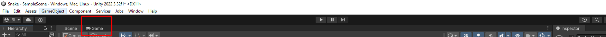
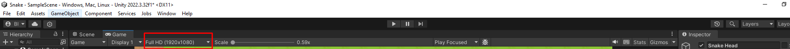
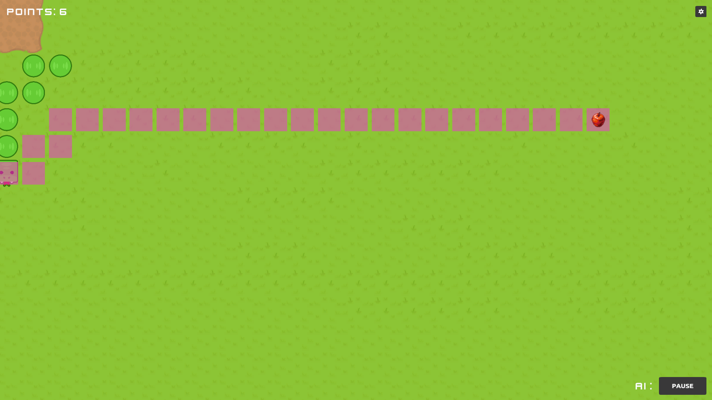

# Snake AI Проект

---

## Опис на проектот

**Snake AI** е напредна верзија на класичната игра Snake која вклучува алгоритми за вештачка интелигенција (AI) за да го подобри играњето. Играта им овозможува на играчите да преминат од рачна контрола во AI контрола. Кога играчот користи AI контрола исто така се симулираат патеките кој што ги разгледува алгоритмот на вештачката интелегенција.

### Карактеристики:
- **Класично играње на Snake**: Навигирајте ја змијата за да јаде јаболка, да расте и да избегнува пречки.
- **AI Алгоритми**: Изберете од различни AI алгоритми за да ја контролирате змијата.
- **Поставки и контроли**:
  - Горен десен агол: Икона за поставки за да се промени AI алгоритмот.
  - Долен десен агол: Копче за стартување или стопирање на AI.
- **Систем за поени**: Поените се прикажани во горниот лев агол.
- **Услови за крај на играта**:
  - Излегување од видното поле.
  - Достигнување на негативни поени.
  - Јадење на сопственото тело на змијата.

## Клонирање и користење

### Претпоставки
- Unity Game Engine
- Програмски јазик C#

### Инсталација
1. Клонирајте го репозиториумот:
   ```sh
   git clone https://github.com/your-username/SnakeAI.git
   ```
2. Отворете го проектот во Unity.
3. За точно да биде прикажана играта треба да ги наместите следните поставки.





## Технички детали

### Структура на кодот
- **`WorldScript.cs`**: Управува со светот на играта, вклучувајќи поставување на јаболка и управување со поените.
- **`SnakeScript.cs`**: Ја контролира змијата.

#### Клучни функции

- **`WorldScript.cs`**:
  - `SpawnObject(GameObject ObjectToSpawn)`: Постави јаболка на случајни позиции на мрежата.
  - `SelectedAI(TMP_Dropdown selected)`: За избирање AI алгоритам од dropdown мени.
  - `UseSelected()`: Го менува користењето на избраниот AI алгоритам.

- **`SnakeScript.cs`**:
  - `GenerateBody()`: Ги генерира сегментите на телото на змијата кога јаде јаболка.
  - `DepthFirstSearch(Vector3 firstState, string firstRotation)`: Имплементација на DFS алгоритмот.
  - `BreadthFirstSearch(Vector3 firstState, string firstRotation)`: Имплементација на BFS алгоритмот.
  - `UniformCostSearch(Vector3 firstState, string firstRotation)`: Имплементација на Uniform Cost алгоритмот.
  - `GreedySearch(Vector3 firstState, string firstRotation)`: Имплементација на Greedy Search алгоритмот.
  - `AstarSearch(Vector3 firstState, string firstRotation)`: Имплементација на A* алгоритмот.

#### Објаснување на една функција (BredthFirstSearch)

  ```c#
    void BredthFirstSearch(Vector3 firstState, string firstRotation)
    {
        SnakePos state = new SnakePos() { Position = firstState, Rotation = firstRotation , Past = null};
        Dictionary<string, SnakePos> states = new Dictionary<string, SnakePos>();
        Queue<SnakePos> actions = new Queue<SnakePos>();
        List<Vector3> visited = new List<Vector3>();
        
        int counterS = 0;

        actions.Enqueue(state);

        while(paths.Count > 0 && !AppleFound)
        {
            Destroy(paths.Pop());
        }


        while (actions.Count > 0 && !AppleFound)
        {
            counterS++;
            SnakePos node = actions.Dequeue();
            if (visited.Contains(node.Position))
                continue;
            visited.Add(node.Position);
            Debug.Log(node.Position + " " + node.Rotation);
            paths.Push(Instantiate(SnakePath, node.Position, Quaternion.identity));

            if (SpacesOnScreen.ContainsKey(node.Position) && isGoal(SpacesOnScreen[node.Position]))
            {
                AICounter = 0;
                SnakePosList.Clear();
                paths.Push(Instantiate(SnakeRedPath, node.Position, Quaternion.identity));
                AppleFound = true;
                SnakePos back = node;
                while(back.Past != null)
                {
                    paths.Push(Instantiate(SnakeRedPath, back.Past.Position, Quaternion.identity));
                    SnakePosList.Add(back);
                    back = back.Past;
                }
                SnakePosList.Reverse();
                Debug.Log("WOOO " + node.Past.Past);
                break;
            }

            states = States(node);
            foreach (string key in states.Keys)
                actions.Enqueue(states[key]);
        }

        if (!AppleFound)
            SceneManager.LoadScene(2);
    }
  ```
1. Иницијализација: Кодот го иницијализира пребарувањето со почетната позиција и насока на змијата. Исто така, поставува речник за следење на состојбите, редица за BFS и листа за следење на посетените позиции.
```c#
SnakePos state = new SnakePos() { Position = firstState, Rotation = firstRotation , Past = null};
Dictionary<string, SnakePos> states = new Dictionary<string, SnakePos>();
Queue<SnakePos> actions = new Queue<SnakePos>();
List<Vector3> visited = new List<Vector3>();
```

2. Чистење: Пред започнување на пребарувањето, ги брише постојните патеки што користат како репрезентација на алгоритмот, со уништување на претходните објекти во играта.
```c#
while(paths.Count > 0 && !AppleFound)
  Destroy(paths.Pop());
```

3. Циклус на Пребарување: Главниот циклус на пребарување ја вади состојбата од редицата, проверува дали веќе е посетена, и ако не е, ја означува како посетена. Потоа ја визуелизира патеката со инстанцирање на објекти во играта.
```c#
SnakePos node = actions.Dequeue();
if (visited.Contains(node.Position))
    continue;
visited.Add(node.Position);
paths.Push(Instantiate(SnakePath, node.Position, Quaternion.identity));
```

4. Проверка на Целта: Ако тековната позиција содржи јаболко, ја означува како пронајдена, ги чисти претходните патеки, и ја следи патеката од целта до почетокот за да се визуелизира решението.
```c#
if (SpacesOnScreen.ContainsKey(node.Position) && isGoal(SpacesOnScreen[node.Position]))
```

5. Проширување на Состојбите: Ако јаболкото не е пронајдено, ги генерира можните следни состојби од тековниот чвор и ги додава во редицата.
```c#
states = States(node);
foreach (string key in states.Keys)
    actions.Enqueue(states[key]);
```
6. Ракување со Неуспех: Ако пребарувањето заврши без пронаоѓање на јаболкото, значи дека се заглавива змијата и нема каде да оди па оди на Game Over сцена

```c#
SceneManager.LoadScene(2);
```

## Слика од играта



### Стартување на играта (Начин 1)
Играта работи само на Full HD 1920-1080.
1. Отворете ја сцената `MainMenu` во Unity.
2. Пред да се почне со играње мора да се смени резулацијата на играта, следете ги чекорите на сликите.


3. Притиснете го копчето за играње во Unity Editor за да ја започнете играта.


### Стартување на играта (Начин 2)
Играта работи само на Full HD 1920-1080.
1. Може да ја најдете build folder од играта во Sorce Codot од играта.
2. Таму има SnakeAI.exe кое што ке ви дозволи да ја играте играта без unity.

## Инструкции за играње

### Основни контроли
- **Рачна контрола**:
  - Користете ги стрелките (Горе, Долу, Лево, Десно) и (W, A, S, D) за да ја движите змијата.
- **AI контрола**:
  - Кликнете на копчето во долниот десен агол за да го стартувате AI.
  - Користете ја иконата за поставки во горниот десен агол за да изберете AI алгоритам.
  - Освојувајте поени со јадење на јаболка.
  - Ако вашите поени паднат под нула, играта завршува.
  - Ако излезете надвор од видното поле играта завршува.
  - Ако змијата гризне дел од своето тело играта завршува.

---
